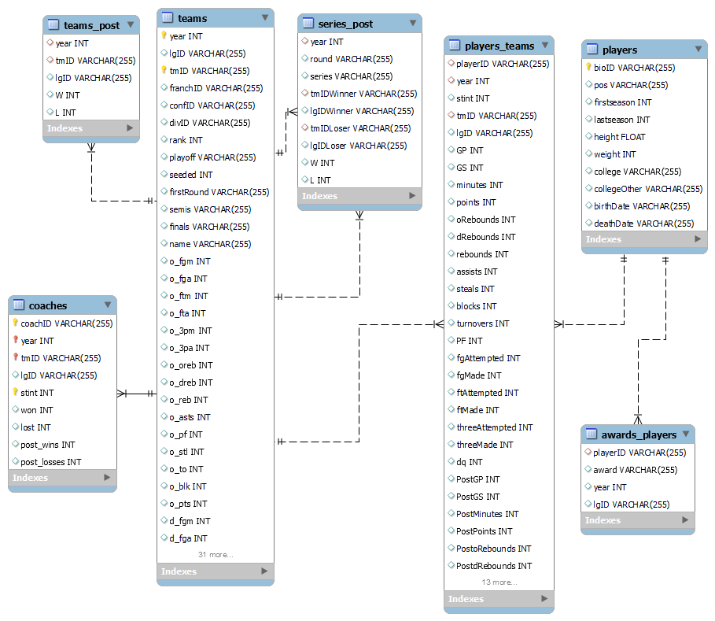

# AC Project

## Basketball Playoffs

Basketball tournaments are usually split in two parts. First, all teams play each other aiming to achieve the greatest number of wins possible. Then, at the end of the first part of the season, a pre determined number of teams which were able to win the most games are qualified to the playoff season, where they play series of knock-out matches for the trophy.

For the 10 years, data from players, teams, coaches, games and several other metrics were gathered and arranged on this dataset. The goal is to use this data to predict which teams will qualify for the playoffs in the next season.

---



## 

### Installing dependencies

Make sure you have installed the dependencies listed in ```specs.txt```. 
To install them, go to the project's root and run this command on the terminal to install all the necessary dependencies:

```bash
pip install -r specs.txt
```

### TEST
Run the files in the following order
- processing.ipynb
- analysis.ipynb
- playerNotebook.ipynb
- coaches.ipynb
- training.ipynb